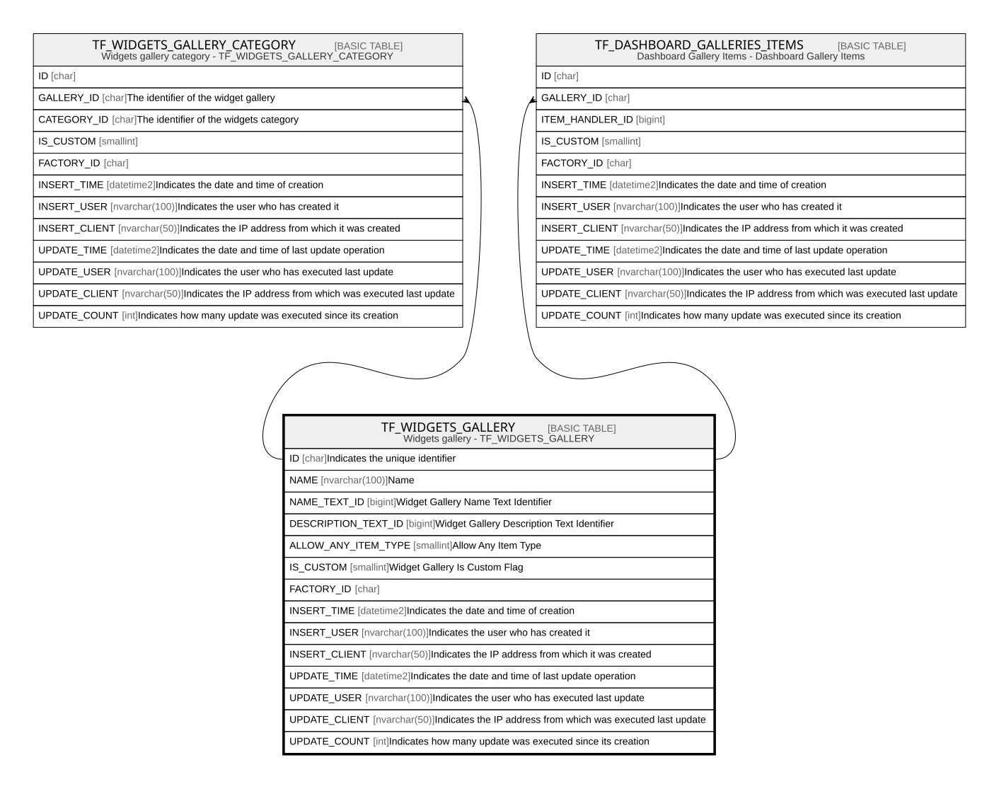

# TF_WIDGETS_GALLERY

## Description

Widgets gallery - TF_WIDGETS_GALLERY  

## Columns

| Name | Type | Default | Nullable | Children | Comment |
| ---- | ---- | ------- | -------- | -------- | ------- |
| ID | char |  | false | [TF_WIDGETS_GALLERY_CATEGORY](TF_WIDGETS_GALLERY_CATEGORY.md) [TF_DASHBOARD_GALLERIES_ITEMS](TF_DASHBOARD_GALLERIES_ITEMS.md) | Indicates the unique identifier |
| NAME | nvarchar(100) |  | false |  | Name |
| NAME_TEXT_ID | bigint |  | false |  | Widget Gallery Name Text Identifier |
| DESCRIPTION_TEXT_ID | bigint |  | false |  | Widget Gallery Description Text Identifier |
| ALLOW_ANY_ITEM_TYPE | smallint | ((1)) | false |  | Allow Any Item Type |
| IS_CUSTOM | smallint |  | false |  | Widget Gallery Is Custom Flag |
| FACTORY_ID | char |  | true |  |  |
| INSERT_TIME | datetime2 | (sysutcdatetime()) | false |  | Indicates the date and time of creation |
| INSERT_USER | nvarchar(100) | (N'MAIN') | false |  | Indicates the user who has created it |
| INSERT_CLIENT | nvarchar(50) | (N'localhost') | false |  | Indicates the IP address from which it was created |
| UPDATE_TIME | datetime2 | (sysutcdatetime()) | false |  | Indicates the date and time of last update operation |
| UPDATE_USER | nvarchar(100) | (N'MAIN') | false |  | Indicates the user who has executed last update |
| UPDATE_CLIENT | nvarchar(50) | (N'localhost') | false |  | Indicates the IP address from which was executed last update |
| UPDATE_COUNT | int | ((0)) | false |  | Indicates how many update was executed since its creation |

## Constraints

| Name | Type | Definition |
| ---- | ---- | ---------- |
| PK_TF_WIDGETS_GALLERY | PRIMARY KEY | CLUSTERED, unique, part of a PRIMARY KEY constraint, [ ID ] |
| UQ_GALLERYNAME | UNIQUE | NONCLUSTERED, unique, part of a UNIQUE constraint, [ NAME, IS_CUSTOM ] |

## Indexes

| Name | Definition |
| ---- | ---------- |
| PK_TF_WIDGETS_GALLERY | CLUSTERED, unique, part of a PRIMARY KEY constraint, [ ID ] |
| UQ_GALLERYNAME | NONCLUSTERED, unique, part of a UNIQUE constraint, [ NAME, IS_CUSTOM ] |
| IDX_WIDGETS_GAL_CUSTOM_FACTORY | NONCLUSTERED, [ FACTORY_ID, IS_CUSTOM ] |

## Relations

---

> Generated by [tbls](https://github.com/k1LoW/tbls)
