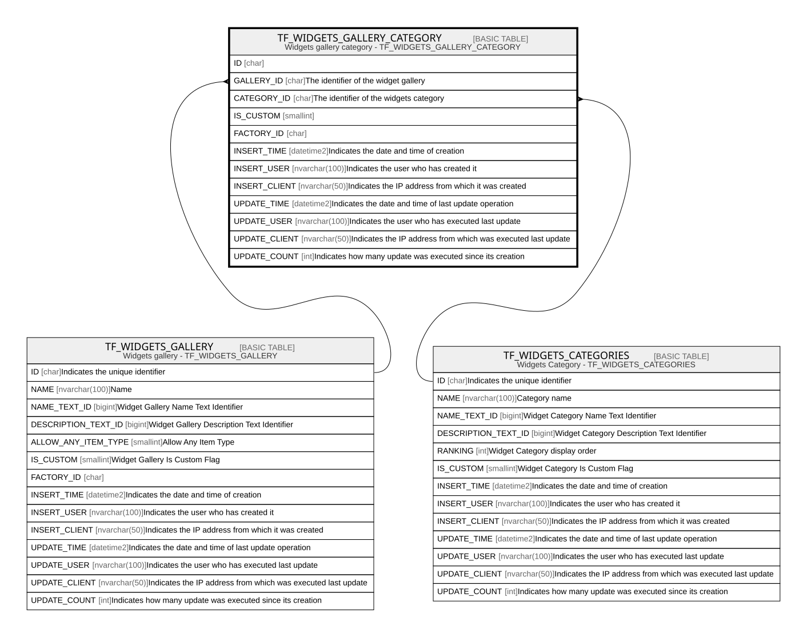

# TF_WIDGETS_GALLERY_CATEGORY

## Description

Widgets gallery category - TF_WIDGETS_GALLERY_CATEGORY  

## Columns

| Name | Type | Default | Nullable | Parents | Comment |
| ---- | ---- | ------- | -------- | ------- | ------- |
| ID | char |  | false |  |  |
| GALLERY_ID | char |  | false | [TF_WIDGETS_GALLERY](TF_WIDGETS_GALLERY.md) | The identifier of the widget gallery |
| CATEGORY_ID | char |  | false | [TF_WIDGETS_CATEGORIES](TF_WIDGETS_CATEGORIES.md) | The identifier of the widgets category |
| IS_CUSTOM | smallint |  | false |  |  |
| FACTORY_ID | char |  | true |  |  |
| INSERT_TIME | datetime2 | (sysutcdatetime()) | false |  | Indicates the date and time of creation |
| INSERT_USER | nvarchar(100) | (N'MAIN') | false |  | Indicates the user who has created it |
| INSERT_CLIENT | nvarchar(50) | (N'localhost') | false |  | Indicates the IP address from which it was created |
| UPDATE_TIME | datetime2 | (sysutcdatetime()) | false |  | Indicates the date and time of last update operation |
| UPDATE_USER | nvarchar(100) | (N'MAIN') | false |  | Indicates the user who has executed last update |
| UPDATE_CLIENT | nvarchar(50) | (N'localhost') | false |  | Indicates the IP address from which was executed last update |
| UPDATE_COUNT | int | ((0)) | false |  | Indicates how many update was executed since its creation |

## Constraints

| Name | Type | Definition |
| ---- | ---- | ---------- |
| PK_TF_WIDGETS_GALLERY_CATEGORY | PRIMARY KEY | CLUSTERED, unique, part of a PRIMARY KEY constraint, [ ID ] |
| UQ_GALLERY_CATEGORIES | UNIQUE | NONCLUSTERED, unique, part of a UNIQUE constraint, [ GALLERY_ID, CATEGORY_ID, IS_CUSTOM ] |
| FK_WIDGETS_CATEGORY | FOREIGN KEY | FOREIGN KEY(CATEGORY_ID) REFERENCES TF_WIDGETS_CATEGORIES(ID) ON UPDATE NO_ACTION ON DELETE NO_ACTION |
| FK_WIDGETS_GALLERY | FOREIGN KEY | FOREIGN KEY(GALLERY_ID) REFERENCES TF_WIDGETS_GALLERY(ID) ON UPDATE NO_ACTION ON DELETE NO_ACTION |

## Indexes

| Name | Definition |
| ---- | ---------- |
| PK_TF_WIDGETS_GALLERY_CATEGORY | CLUSTERED, unique, part of a PRIMARY KEY constraint, [ ID ] |
| UQ_GALLERY_CATEGORIES | NONCLUSTERED, unique, part of a UNIQUE constraint, [ GALLERY_ID, CATEGORY_ID, IS_CUSTOM ] |
| IDX_WID_GAL_CAT_CUSTOM_FACTORY | NONCLUSTERED, [ FACTORY_ID, IS_CUSTOM ] |

## Relations

---

> Generated by [tbls](https://github.com/k1LoW/tbls)
