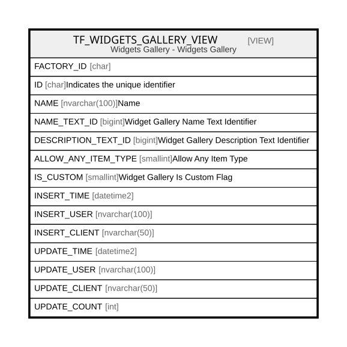

# TF_WIDGETS_GALLERY_VIEW

## Description

Widgets Gallery - Widgets Gallery  


<details>
<summary><strong>Table Definition</strong></summary>

```sql
-- Talentia Software - All right reserved
-- Type: VIEW                     Name: TF_WIDGETS_GALLERY_VIEW
-- Date: 09-04-2026 07:27:59 (UTC)
-- 
-- ChangeLogId: 00000000-0000-0000-0000-000000000000
-- ChangeSetId: 6dcf9a04-cc96-4219-b959-7c4dec17ba57
-- Original file name: C:\repos\Talentia-Software\hcm-core/DB/ProductDB/EDM\Schema\Views\TF_WIDGETS_GALLERY_VIEW.xml


CREATE VIEW [TF_WIDGETS_GALLERY_VIEW]
 AS 
( 
          SELECT FACTORY_ID,
                 ID,
                 NAME,
                 NAME_TEXT_ID,
                 DESCRIPTION_TEXT_ID,
                 ALLOW_ANY_ITEM_TYPE,
                 IS_CUSTOM,
                 INSERT_TIME,
                 INSERT_USER,
                 INSERT_CLIENT,
                 UPDATE_TIME,
                 UPDATE_USER,
                 UPDATE_CLIENT,
                 UPDATE_COUNT
          FROM TF_WIDGETS_GALLERY
          WHERE IS_CUSTOM = 1
          UNION ALL
          SELECT FACTORY_ID,
                 ID,
                 NAME,
                 NAME_TEXT_ID,
                 DESCRIPTION_TEXT_ID,
                 ALLOW_ANY_ITEM_TYPE,
                 IS_CUSTOM,
                 INSERT_TIME,
                 INSERT_USER,
                 INSERT_CLIENT,
                 UPDATE_TIME,
                 UPDATE_USER,
                 UPDATE_CLIENT,
                 UPDATE_COUNT
          FROM TF_WIDGETS_GALLERY
          WHERE IS_CUSTOM = 0 AND NOT EXISTS (SELECT ID FROM TF_WIDGETS_GALLERY WG WHERE WG.IS_CUSTOM = 1 AND TF_WIDGETS_GALLERY.ID = WG.FACTORY_ID)
         )

```

</details>

## Columns

| Name | Type | Default | Nullable | Comment |
| ---- | ---- | ------- | -------- | ------- |
| FACTORY_ID | char |  | true |  |
| ID | char |  | false | Indicates the unique identifier |
| NAME | nvarchar(100) |  | false | Name |
| NAME_TEXT_ID | bigint |  | false | Widget Gallery Name Text Identifier |
| DESCRIPTION_TEXT_ID | bigint |  | false | Widget Gallery Description Text Identifier |
| ALLOW_ANY_ITEM_TYPE | smallint |  | false | Allow Any Item Type |
| IS_CUSTOM | smallint |  | false | Widget Gallery Is Custom Flag |
| INSERT_TIME | datetime2 |  | false |  |
| INSERT_USER | nvarchar(100) |  | false |  |
| INSERT_CLIENT | nvarchar(50) |  | false |  |
| UPDATE_TIME | datetime2 |  | false |  |
| UPDATE_USER | nvarchar(100) |  | false |  |
| UPDATE_CLIENT | nvarchar(50) |  | false |  |
| UPDATE_COUNT | int |  | false |  |

## Referenced Tables

| Name | Columns | Comment | Type |
| ---- | ------- | ------- | ---- |
| [TF_WIDGETS_GALLERY](TF_WIDGETS_GALLERY.md) | 14 | Widgets gallery - TF_WIDGETS_GALLERY<br /> | BASIC TABLE |

## Relations



---

> Generated by [tbls](https://github.com/k1LoW/tbls)
