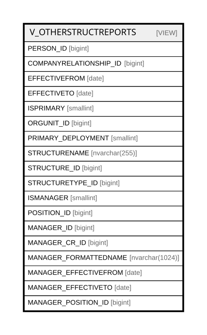

# V_OTHERSTRUCTREPORTS

## Description

<details>
<summary><strong>Table Definition</strong></summary>

```sql
-- Talentia Software - All right reserved
-- Type: VIEW                     Name: V_OTHERSTRUCTREPORTS
-- Date: 09-04-2026 07:27:59 (UTC)
-- 
-- ChangeLogId: 00000000-0000-0000-0000-000000000000
-- ChangeSetId: 0f760b38-699e-4bf6-adb8-b0cb28c0a142
-- Original file name: C:\repos\Talentia-Software\hcm-core/DB/ProductDB/EDM\Schema\Views\0020_V_OTHERSTRUCTREPORTS.xml


CREATE VIEW [V_OTHERSTRUCTREPORTS]
 ( PERSON_ID, COMPANYRELATIONSHIP_ID, EFFECTIVEFROM, EFFECTIVETO, ISPRIMARY, ORGUNIT_ID, PRIMARY_DEPLOYMENT, STRUCTURENAME, STRUCTURE_ID, STRUCTURETYPE_ID, ISMANAGER, POSITION_ID, MANAGER_ID, MANAGER_CR_ID, MANAGER_FORMATTEDNAME, MANAGER_EFFECTIVEFROM, MANAGER_EFFECTIVETO, MANAGER_POSITION_ID ) 
 AS 
( 
          SELECT
          CR.PERSON_ID, CR.ID COMPANYRELATIONSHIP_ID, CR.EFFECTIVEFROM, CR.EFFECTIVETO, CR.ISPRIMARY
          ,OUA.ORGUNIT_ID,OUA.ISPRIMARY PRIMARY_DEPLOYMENT
          ,S.STRUCTURENAME, S.ID STRUCTURE_ID, S.STRUCTURETYPE_ID
          ,PS.ISMANAGER, PS.ID POSITION_ID
          ,CRM.PERSON_ID MANAGER_ID
          ,OUAM.COMPANYRELATIONSHIP_ID MANAGER_CR_ID
          ,PM.FORMATTEDNAME MANAGER_FORMATTEDNAME
          ,(SELECT Max(v) FROM (VALUES ((OUA.EFFECTIVEFROM)), ((OUAM.EFFECTIVEFROM)), ((PSU.EFFECTIVEFROM))) AS value(v)) as MANAGER_EFFECTIVEFROM
          ,(SELECT Min(v) FROM (VALUES ((OUA.EFFECTIVETO)), ((OUAM.EFFECTIVETO)), ((PSU.EFFECTIVETO))) AS value(v)) as MANAGER_EFFECTIVETO
          ,PSM.ID AS MANAGER_POSITION_ID
          FROM
          HR_COMPANYRELATIONSHIP CR
          JOIN HR_OTHERSTRUCTASSIGNMENT OUA ON OUA.COMPANYRELATIONSHIP_ID = CR.ID
          JOIN HR_POSITION PS ON PS.ID = OUA.POSITION_ID AND PS.ISMANAGER = 0
          LEFT JOIN HR_POSITIONSINUNIT PSU ON PSU.RELATEDPARTY_ID = OUA.ORGUNIT_ID AND PSU.PARTY_ID <> PS.ID
          JOIN HR_STRUCTURE S ON S.ID = PSU.STRUCTURE_ID AND S.STRUCTURETYPE_ID = 1000002
          LEFT JOIN HR_POSITION PSM ON PSM.ID = PSU.PARTY_ID AND PSM.ISMANAGER = 1
          JOIN HR_OTHERSTRUCTASSIGNMENT OUAM ON OUAM.POSITION_ID = PSM.ID
          AND ((OUAM.EFFECTIVEFROM BETWEEN OUA.EFFECTIVEFROM AND OUA.EFFECTIVETO) or
          (OUAM.EFFECTIVETO BETWEEN OUA.EFFECTIVEFROM AND OUA.EFFECTIVETO) or
          (OUAM.EFFECTIVETO >= OUA.EFFECTIVETO and OUAM.EFFECTIVEFROM <= OUA.EFFECTIVEFROM))
          LEFT JOIN HR_COMPANYRELATIONSHIP CRM ON CRM.ID = OUAM.COMPANYRELATIONSHIP_ID
          LEFT JOIN HR_PERSON PM ON PM.ID = CRM.PERSON_ID

          UNION

          SELECT
          CR.PERSON_ID, CR.ID COMPANYRELATIONSHIP_ID, CR.EFFECTIVEFROM, CR.EFFECTIVETO, CR.ISPRIMARY
          ,OUA.ORGUNIT_ID,OUA.ISPRIMARY
          ,S.STRUCTURENAME, S.ID STRUCTURE_ID, S.STRUCTURETYPE_ID
          ,PS.ISMANAGER, PS.ID POSITION_ID
          ,CRM.PERSON_ID MANAGER_ID
          ,OUAM.COMPANYRELATIONSHIP_ID MANAGER_CR_ID
          ,PM.FORMATTEDNAME MANAGER_FORMATTEDNAME
          ,(SELECT Max(v) FROM (VALUES ((OUA.EFFECTIVEFROM)), ((OUAC.EFFECTIVEFROM)), ((OUAM.EFFECTIVEFROM)),((PSU.EFFECTIVEFROM))) AS value(v)) as MANAGER_EFFECTIVEFROM
          ,(SELECT Min(v) FROM (VALUES ((OUA.EFFECTIVETO)), ((OUAC.EFFECTIVETO)), ((OUAM.EFFECTIVETO)), ((PSU.EFFECTIVETO))) AS value(v)) as MANAGER_EFFECTIVETO
          ,PSM.ID AS MANAGER_POSITION_ID
          FROM
          HR_COMPANYRELATIONSHIP CR
          JOIN HR_OTHERSTRUCTASSIGNMENT OUA ON OUA.COMPANYRELATIONSHIP_ID = CR.ID
          JOIN HR_POSITION PS ON PS.ID = OUA.POSITION_ID AND PS.ISMANAGER = 1
          JOIN HR_ORGUNITACCOUNTABILITY OUAC ON OUAC.PARTY_ID = OUA.ORGUNIT_ID
          AND ((OUAC.EFFECTIVEFROM BETWEEN OUA.EFFECTIVEFROM AND OUA.EFFECTIVETO) OR
          (OUAC.EFFECTIVETO BETWEEN OUA.EFFECTIVEFROM AND OUA.EFFECTIVETO) or
          (OUAC.EFFECTIVEFROM <= OUA.EFFECTIVEFROM and OUAC.EFFECTIVETO >= OUA.EFFECTIVETO))
          JOIN HR_STRUCTURE S ON S.ID = OUAC.STRUCTURE_ID AND S.STRUCTURETYPE_ID = 1000002
          JOIN HR_POSITIONSINUNIT PSU ON PSU.RELATEDPARTY_ID = OUAC.RELATEDPARTY_ID
          JOIN HR_POSITION PSM ON PSM.ID = PSU.PARTY_ID AND PSM.ISMANAGER = 1
          JOIN HR_OTHERSTRUCTASSIGNMENT OUAM ON OUAM.POSITION_ID = PSM.ID
          AND ((OUAM.EFFECTIVEFROM BETWEEN OUA.EFFECTIVEFROM AND OUA.EFFECTIVETO) or
          (OUAM.EFFECTIVETO BETWEEN OUA.EFFECTIVEFROM AND OUA.EFFECTIVETO) or
          (OUAM.EFFECTIVETO >= OUA.EFFECTIVETO and OUAM.EFFECTIVEFROM <= OUA.EFFECTIVEFROM))
          AND ((OUAM.EFFECTIVEFROM BETWEEN OUAC.EFFECTIVEFROM AND OUAC.EFFECTIVETO) or
          (OUAM.EFFECTIVETO BETWEEN OUAC.EFFECTIVEFROM AND OUAC.EFFECTIVETO) or
          (OUAM.EFFECTIVETO >= OUAC.EFFECTIVETO and OUAM.EFFECTIVEFROM <= OUAC.EFFECTIVEFROM))
          JOIN HR_COMPANYRELATIONSHIP CRM ON CRM.ID = OUAM.COMPANYRELATIONSHIP_ID
          JOIN HR_PERSON PM ON PM.ID = CRM.PERSON_ID
         )

```

</details>

## Columns

| Name | Type | Default | Nullable | Comment |
| ---- | ---- | ------- | -------- | ------- |
| PERSON_ID | bigint |  | false |  |
| COMPANYRELATIONSHIP_ID | bigint |  | false |  |
| EFFECTIVEFROM | date |  | false |  |
| EFFECTIVETO | date |  | true |  |
| ISPRIMARY | smallint |  | true |  |
| ORGUNIT_ID | bigint |  | true |  |
| PRIMARY_DEPLOYMENT | smallint |  | true |  |
| STRUCTURENAME | nvarchar(255) |  | true |  |
| STRUCTURE_ID | bigint |  | false |  |
| STRUCTURETYPE_ID | bigint |  | true |  |
| ISMANAGER | smallint |  | true |  |
| POSITION_ID | bigint |  | false |  |
| MANAGER_ID | bigint |  | true |  |
| MANAGER_CR_ID | bigint |  | false |  |
| MANAGER_FORMATTEDNAME | nvarchar(1024) |  | true |  |
| MANAGER_EFFECTIVEFROM | date |  | true |  |
| MANAGER_EFFECTIVETO | date |  | true |  |
| MANAGER_POSITION_ID | bigint |  | true |  |

## Referenced Tables

| Name | Columns | Comment | Type |
| ---- | ------- | ------- | ---- |
| [VALUES](VALUES.md) | 0 |  |  |
| [HR_COMPANYRELATIONSHIP](HR_COMPANYRELATIONSHIP.md) | 47 | Company Relationship - Provides key information about an employment contract associated with a staffing assignment or staffing resource.<br /> | BASIC TABLE |
| [HR_OTHERSTRUCTASSIGNMENT](HR_OTHERSTRUCTASSIGNMENT.md) | 22 | Other Structure Assignment - Is a deployment of a employee in a Structure which is an alternative to the Organizational Structure. Used for example, to represent Deployment by Project or Deployment in Simulated Structures.<br /> | BASIC TABLE |
| [HR_POSITION](HR_POSITION.md) | 18 | Position - A single or specific instance of a job in the context of an Organizational Structure.<br /> | BASIC TABLE |
| [HR_POSITIONSINUNIT](HR_POSITIONSINUNIT.md) | 19 | Positions in Organizational Unit - This represents the relationship between Positions and Units.<br /> | BASIC TABLE |
| [HR_STRUCTURE](HR_STRUCTURE.md) | 27 | STRUCTURES - STRUCTURES<br /> | BASIC TABLE |
| [HR_PERSON](HR_PERSON.md) | 56 | Person - Contains information identifying the person.<br /> | BASIC TABLE |
| [HR_ORGUNITACCOUNTABILITY](HR_ORGUNITACCOUNTABILITY.md) | 19 | Organizational Unit to Organizational Unit Accountabilities - This Entity is used to represent hierarchies between Organizational Units.<br /> | BASIC TABLE |

## Relations



---

> Generated by [tbls](https://github.com/k1LoW/tbls)
