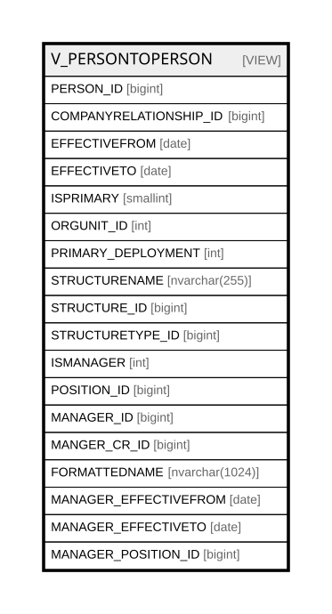

# V_PERSONTOPERSON

## Description

<details>
<summary><strong>Table Definition</strong></summary>

```sql
-- Talentia Software - All right reserved
-- Type: VIEW                     Name: V_PERSONTOPERSON
-- Date: 09-04-2026 07:27:59 (UTC)
-- 
-- ChangeLogId: 00000000-0000-0000-0000-000000000000
-- ChangeSetId: b77098f3-d740-4599-803c-f2c8e8d5d7f3
-- Original file name: C:\repos\Talentia-Software\hcm-core/DB/ProductDB/EDM\Schema\Views\0030_V_PERSONTOPERSON.xml


CREATE VIEW [V_PERSONTOPERSON]
 ( PERSON_ID, COMPANYRELATIONSHIP_ID, EFFECTIVEFROM, EFFECTIVETO, ISPRIMARY, ORGUNIT_ID, PRIMARY_DEPLOYMENT, STRUCTURENAME, STRUCTURE_ID, STRUCTURETYPE_ID, ISMANAGER, POSITION_ID, MANAGER_ID, MANGER_CR_ID, FORMATTEDNAME, MANAGER_EFFECTIVEFROM, MANAGER_EFFECTIVETO, MANAGER_POSITION_ID ) 
 AS 
( 
          SELECT
          PARTY_ID as PERSON_ID,
          hr_COMPANYRELATIONSHIP.id as COMPANYRELATIONSHIP_ID,
          HR_PERSONACCOUNTABILITY.EFFECTIVEFROM,
          HR_PERSONACCOUNTABILITY.EFFECTIVETO,
          hr_COMPANYRELATIONSHIP.ISPRIMARY AS ISPRIMARY, -- ISPRIMARY
          NULL AS ORGUNIT_ID, -- ORGUNIT_ID
          NULL AS PRIMARY_DEPLOYMENT,
          S.STRUCTURENAME,
          STRUCTURE_ID,
          S.STRUCTURETYPE_ID,
          CASE	WHEN RELATEDPARTY_ID IS NULL THEN 1 ELSE 0 END AS ISMANAGER,
          HR_ORGUNITASSIGNMENT.POSITION_ID AS POSITION_ID,
          RELATEDPARTY_ID AS MANAGER_ID,
          CRMGR.ID AS MANGER_CR_ID, -- MANAGER_COMPANYRELATIONSHIP_ID
          P.FORMATTEDNAME,
          HR_PERSONACCOUNTABILITY.EFFECTIVEFROM MANAGER_EFFECTIVEFROM,
          HR_PERSONACCOUNTABILITY.EFFECTIVETO MANAGER_EFFECTIVETO,
          OUAM.POSITION_ID AS MANAGER_POSITION_ID
          FROM HR_PERSONACCOUNTABILITY
          LEFT OUTER JOIN HR_COMPANYRELATIONSHIP ON (HR_PERSONACCOUNTABILITY.PARTY_ID = hr_COMPANYRELATIONSHIP.PERSON_ID
          AND HR_COMPANYRELATIONSHIP.ISPRIMARY = 1
          AND (HR_COMPANYRELATIONSHIP.EFFECTIVEFROM BETWEEN HR_PERSONACCOUNTABILITY.EFFECTIVEFROM AND HR_PERSONACCOUNTABILITY.EFFECTIVETO
          OR HR_COMPANYRELATIONSHIP.EFFECTIVETO BETWEEN HR_PERSONACCOUNTABILITY.EFFECTIVEFROM AND HR_PERSONACCOUNTABILITY.EFFECTIVETO
          OR HR_COMPANYRELATIONSHIP.EFFECTIVEFROM <= HR_PERSONACCOUNTABILITY.EFFECTIVEFROM
          AND HR_COMPANYRELATIONSHIP.EFFECTIVETO >= HR_PERSONACCOUNTABILITY.EFFECTIVETO))
          LEFT OUTER JOIN HR_ORGUNITASSIGNMENT ON HR_ORGUNITASSIGNMENT.COMPANYRELATIONSHIP_ID = HR_COMPANYRELATIONSHIP.ID
          AND HR_ORGUNITASSIGNMENT.ISPRIMARY = 1
          AND HR_PERSONACCOUNTABILITY.EFFECTIVETO BETWEEN  HR_ORGUNITASSIGNMENT.EFFECTIVEFROM AND HR_ORGUNITASSIGNMENT.EFFECTIVETO

          --AND ((HR_ORGUNITASSIGNMENT.EFFECTIVEFROM BETWEEN HR_COMPANYRELATIONSHIP.EFFECTIVEFROM AND HR_COMPANYRELATIONSHIP.EFFECTIVETO) or
          --	(HR_ORGUNITASSIGNMENT.EFFECTIVETO BETWEEN HR_COMPANYRELATIONSHIP.EFFECTIVEFROM AND HR_COMPANYRELATIONSHIP.EFFECTIVETO) or
          --	(HR_ORGUNITASSIGNMENT.EFFECTIVETO >= HR_COMPANYRELATIONSHIP.EFFECTIVETO and HR_ORGUNITASSIGNMENT.EFFECTIVEFROM <= HR_COMPANYRELATIONSHIP.EFFECTIVEFROM))

          LEFT OUTER JOIN HR_COMPANYRELATIONSHIP CRMGR ON (HR_PERSONACCOUNTABILITY.RELATEDPARTY_ID = CRMGR.PERSON_ID
          AND CRMGR.ISPRIMARY = 1
          AND (CRMGR.EFFECTIVEFROM BETWEEN HR_PERSONACCOUNTABILITY.EFFECTIVEFROM AND HR_PERSONACCOUNTABILITY.EFFECTIVETO
          OR CRMGR.EFFECTIVETO BETWEEN HR_PERSONACCOUNTABILITY.EFFECTIVEFROM AND HR_PERSONACCOUNTABILITY.EFFECTIVETO
          OR CRMGR.EFFECTIVEFROM <= HR_PERSONACCOUNTABILITY.EFFECTIVEFROM
          AND CRMGR.EFFECTIVETO >= HR_PERSONACCOUNTABILITY.EFFECTIVETO))
          LEFT OUTER JOIN HR_ORGUNITASSIGNMENT OUAM ON OUAM.COMPANYRELATIONSHIP_ID = CRMGR.ID
          AND OUAM.ISPRIMARY = 1
          AND HR_PERSONACCOUNTABILITY.EFFECTIVETO BETWEEN  OUAM.EFFECTIVEFROM AND OUAM.EFFECTIVETO

          --AND ((OUAM.EFFECTIVEFROM BETWEEN CRMGR.EFFECTIVEFROM AND CRMGR.EFFECTIVETO) or
          --	(OUAM.EFFECTIVETO BETWEEN CRMGR.EFFECTIVEFROM AND CRMGR.EFFECTIVETO) or
          --	(OUAM.EFFECTIVETO >= CRMGR.EFFECTIVETO and OUAM.EFFECTIVEFROM <= CRMGR.EFFECTIVEFROM))

          INNER JOIN HR_STRUCTURE S ON HR_PERSONACCOUNTABILITY.STRUCTURE_ID = S.ID
          LEFT OUTER JOIN HR_PERSON P ON P.ID = HR_PERSONACCOUNTABILITY.RELATEDPARTY_ID
         )

```

</details>

## Columns

| Name | Type | Default | Nullable | Comment |
| ---- | ---- | ------- | -------- | ------- |
| PERSON_ID | bigint |  | false |  |
| COMPANYRELATIONSHIP_ID | bigint |  | true |  |
| EFFECTIVEFROM | date |  | false |  |
| EFFECTIVETO | date |  | true |  |
| ISPRIMARY | smallint |  | true |  |
| ORGUNIT_ID | int |  | true |  |
| PRIMARY_DEPLOYMENT | int |  | true |  |
| STRUCTURENAME | nvarchar(255) |  | true |  |
| STRUCTURE_ID | bigint |  | false |  |
| STRUCTURETYPE_ID | bigint |  | true |  |
| ISMANAGER | int |  | false |  |
| POSITION_ID | bigint |  | true |  |
| MANAGER_ID | bigint |  | true |  |
| MANGER_CR_ID | bigint |  | true |  |
| FORMATTEDNAME | nvarchar(1024) |  | true |  |
| MANAGER_EFFECTIVEFROM | date |  | false |  |
| MANAGER_EFFECTIVETO | date |  | true |  |
| MANAGER_POSITION_ID | bigint |  | true |  |

## Referenced Tables

| Name | Columns | Comment | Type |
| ---- | ------- | ------- | ---- |
| [HR_PERSONACCOUNTABILITY](HR_PERSONACCOUNTABILITY.md) | 19 | Person Accountabilities - This Entity represents "Relationships" between persons. Used for example to represent an alternative Person to Person reporting structure.<br /> | BASIC TABLE |
| [HR_COMPANYRELATIONSHIP](HR_COMPANYRELATIONSHIP.md) | 47 | Company Relationship - Provides key information about an employment contract associated with a staffing assignment or staffing resource.<br /> | BASIC TABLE |
| [HR_ORGUNITASSIGNMENT](HR_ORGUNITASSIGNMENT.md) | 21 | Organizational Deployment - Is the position or designation of the person within the given organization. Examples are Director, Software Engineer, Purchasing Manager etc.<br /> | BASIC TABLE |
| [HR_STRUCTURE](HR_STRUCTURE.md) | 27 | STRUCTURES - STRUCTURES<br /> | BASIC TABLE |
| [HR_PERSON](HR_PERSON.md) | 56 | Person - Contains information identifying the person.<br /> | BASIC TABLE |

## Relations



---

> Generated by [tbls](https://github.com/k1LoW/tbls)
