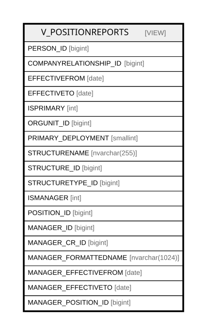

# V_POSITIONREPORTS

## Description

<details>
<summary><strong>Table Definition</strong></summary>

```sql
-- Talentia Software - All right reserved
-- Type: VIEW                     Name: V_POSITIONREPORTS
-- Date: 09-04-2026 07:27:59 (UTC)
-- 
-- ChangeLogId: 00000000-0000-0000-0000-000000000000
-- ChangeSetId: b9c6ab4f-84ba-4068-a144-9d60d23a8a82
-- Original file name: C:\repos\Talentia-Software\hcm-core/DB/ProductDB/EDM\Schema\Views\0040_V_POSITIONREPORTS.xml


CREATE VIEW [V_POSITIONREPORTS]
 ( PERSON_ID, COMPANYRELATIONSHIP_ID, EFFECTIVEFROM, EFFECTIVETO, ISPRIMARY, ORGUNIT_ID, PRIMARY_DEPLOYMENT, STRUCTURENAME, STRUCTURE_ID, STRUCTURETYPE_ID, ISMANAGER, POSITION_ID, MANAGER_ID, MANAGER_CR_ID, MANAGER_FORMATTEDNAME, MANAGER_EFFECTIVEFROM, MANAGER_EFFECTIVETO, MANAGER_POSITION_ID ) 
 AS 
( SELECT
CR.PERSON_ID        AS PERSON_ID             ,
CR.ID               AS COMPANYRELATIONSHIP_ID,
CONVERT(DATE, NULL) AS EFFECTIVEFROM         , --Ignored
CONVERT(DATE, NULL) AS EFFECTIVETO           , --Ignored
NULL                AS ISPRIMARY             , --Ignored
OUASS.ORGUNIT_ID    AS ORGUNIT_ID            ,
OUASS.ISPRIMARY     AS PRIMARY_DEPLOYMENT    ,
S.STRUCTURENAME     AS STRUCTURENAME         ,
S.ID                AS STRUCTURE_ID          ,
S.STRUCTURETYPE_ID  AS STRUCTURETYPE_ID      ,
NULL                AS ISMANAGER             , --Ignored
OUASSP.POSITION_ID  AS POSITION_ID           ,
CRP.PERSON_ID       AS MANAGER_ID            ,
CRP.ID              AS MANAGER_CR_ID         ,
MP.FORMATTEDNAME    AS MANAGER_FORMATTEDNAME ,
(SELECT MAX(V) FROM (VALUES (OUASS.EFFECTIVEFROM), (OUASSP.EFFECTIVEFROM), (PSACC.EFFECTIVEFROM)) AS VALUE(V)) AS MANAGER_EFFECTIVEFROM,
(SELECT MIN(V) FROM (VALUES (OUASS.EFFECTIVETO)  , (OUASSP.EFFECTIVETO)  , (PSACC.EFFECTIVETO))   AS VALUE(V)) AS MANAGER_EFFECTIVETO  ,
PSACC.RELATEDPARTY_ID AS MANAGER_POSITION_ID

FROM HR_STRUCTURE                  S
JOIN HR_POSITIONACCOUNTABILITY PSACC ON (PSACC.STRUCTURE_ID = S.ID)
JOIN HR_ORGUNITASSIGNMENT      OUASS ON (OUASS.POSITION_ID  = PSACC.PARTY_ID 
                                    AND (OUASS.EFFECTIVEFROM <= PSACC.EFFECTIVETO AND OUASS.EFFECTIVETO >= PSACC.EFFECTIVEFROM)) --Overlapping condition: Employee's position with accountability
JOIN HR_COMPANYRELATIONSHIP       CR ON (CR.ID  = OUASS.COMPANYRELATIONSHIP_ID)
JOIN HR_ORGUNITASSIGNMENT     OUASSP ON (OUASSP.POSITION_ID = PSACC.RELATEDPARTY_ID
                                    AND (OUASSP.EFFECTIVEFROM <= PSACC.EFFECTIVETO AND OUASSP.EFFECTIVETO >= PSACC.EFFECTIVEFROM)) --Overlapping condition: Manager's position with accountability
JOIN HR_COMPANYRELATIONSHIP      CRP ON (CRP.ID = OUASSP.COMPANYRELATIONSHIP_ID)
JOIN HR_PERSON                    MP ON (MP.ID  = CRP.PERSON_ID)
WHERE
S.STRUCTURETYPE_ID = 1000004
AND (OUASS.EFFECTIVEFROM <= OUASSP.EFFECTIVETO AND OUASS.EFFECTIVETO >= OUASSP.EFFECTIVEFROM) --Overlapping condition between parties: Manager's and Emplyee's positions should overlap to have meaningful relation
GROUP BY
CR.PERSON_ID        ,
CR.ID               ,
OUASS.ORGUNIT_ID    ,
OUASS.ISPRIMARY     ,
S.STRUCTURENAME     ,
S.ID                ,
S.STRUCTURETYPE_ID  ,
OUASSP.POSITION_ID  ,
CRP.PERSON_ID       ,
CRP.ID              ,
MP.FORMATTEDNAME    ,
OUASS.EFFECTIVEFROM ,
OUASS.EFFECTIVETO   ,
PSACC.EFFECTIVEFROM ,
PSACC.EFFECTIVETO   ,
OUASSP.EFFECTIVEFROM,
OUASSP.EFFECTIVETO  ,
PSACC.RELATEDPARTY_ID )

```

</details>

## Columns

| Name | Type | Default | Nullable | Comment |
| ---- | ---- | ------- | -------- | ------- |
| PERSON_ID | bigint |  | false |  |
| COMPANYRELATIONSHIP_ID | bigint |  | false |  |
| EFFECTIVEFROM | date |  | true |  |
| EFFECTIVETO | date |  | true |  |
| ISPRIMARY | int |  | true |  |
| ORGUNIT_ID | bigint |  | true |  |
| PRIMARY_DEPLOYMENT | smallint |  | true |  |
| STRUCTURENAME | nvarchar(255) |  | true |  |
| STRUCTURE_ID | bigint |  | false |  |
| STRUCTURETYPE_ID | bigint |  | true |  |
| ISMANAGER | int |  | true |  |
| POSITION_ID | bigint |  | true |  |
| MANAGER_ID | bigint |  | false |  |
| MANAGER_CR_ID | bigint |  | false |  |
| MANAGER_FORMATTEDNAME | nvarchar(1024) |  | true |  |
| MANAGER_EFFECTIVEFROM | date |  | true |  |
| MANAGER_EFFECTIVETO | date |  | true |  |
| MANAGER_POSITION_ID | bigint |  | true |  |

## Referenced Tables

| Name | Columns | Comment | Type |
| ---- | ------- | ------- | ---- |
| [VALUES](VALUES.md) | 0 |  |  |
| [HR_STRUCTURE](HR_STRUCTURE.md) | 27 | STRUCTURES - STRUCTURES<br /> | BASIC TABLE |
| [HR_POSITIONACCOUNTABILITY](HR_POSITIONACCOUNTABILITY.md) | 19 | Position to Position Accountabilies - This Entity represents "Relationships" between positions. Used for example to represent a functional structure as opposed to an Organizational Structure.<br /> | BASIC TABLE |
| [HR_ORGUNITASSIGNMENT](HR_ORGUNITASSIGNMENT.md) | 21 | Organizational Deployment - Is the position or designation of the person within the given organization. Examples are Director, Software Engineer, Purchasing Manager etc.<br /> | BASIC TABLE |
| [HR_COMPANYRELATIONSHIP](HR_COMPANYRELATIONSHIP.md) | 47 | Company Relationship - Provides key information about an employment contract associated with a staffing assignment or staffing resource.<br /> | BASIC TABLE |
| [HR_PERSON](HR_PERSON.md) | 56 | Person - Contains information identifying the person.<br /> | BASIC TABLE |

## Relations



---

> Generated by [tbls](https://github.com/k1LoW/tbls)
